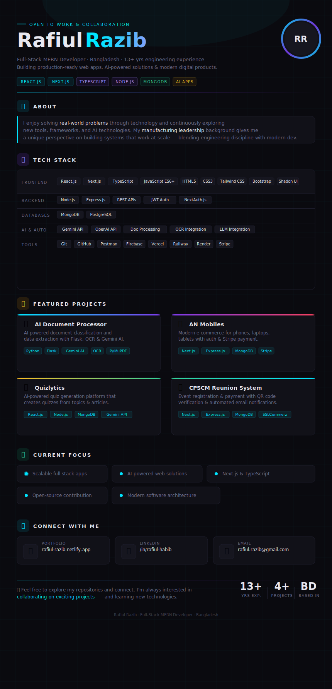

  

---

### 📊 GitHub Stats

  
  

---

  <a href="https://rafiul-razib.netlify.app">🌐 Portfolio</a> &nbsp;·&nbsp;
  <a href="https://www.linkedin.com/in/rafiul-habib">💼 LinkedIn</a> &nbsp;·&nbsp;
  <a href="mailto:rafiul.razib@gmail.com">📧 Email</a>

